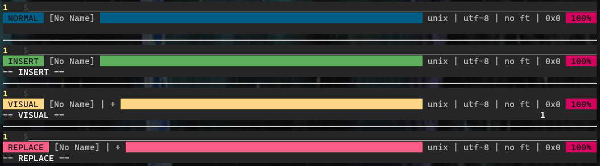

# rock-lightline

colorscheme for [lightline.vim](https://github.com/itchyny/lightline.vim)



## Install via [vim-plug](https://github.com/junegunn/vim-plug) 

In `~/.vimrc`, add `Plug` to `plug` function and customize lightline colorscheme like so...

```vim
call plug#begin('~/.vim/plugged')
Plug 'itchyny/lightline.vim'
Plug 'treatmesubj/rock-lightline'
call plug#end()

let g:lightline = {
      \ 'colorscheme': 'rock',
      \ 'active': {
      \   'left': [ [ 'mode', 'paste' ],
      \             [ 'readonly', 'filename', 'modified' ] ],
      \   'right': [ [ 'percent' ],
      \              [ 'fileformat', 'fileencoding', 'filetype', 'charvaluehex' ] ]
      \ },
      \ 'component': {
      \   'charvaluehex': '0x%B',
      \   'position': '%l,%c',
      \   'pos+hex': '%l,%c:0x%B',
      \ },
      \ }
```

Then...
```bash
vim ~/.vimrc  # then, ':PlugInstall'
```

---
# Bonus: Bash vi mode colors

- `~/.bashrc`
```bash
set -o vi
```

- `~/.inputrc`
```bash
set show-mode-in-prompt on
set vi-ins-mode-string "\1\e[38;5;16;48;5;71m\2 INSERT \1\e[0m\2"
set vi-cmd-mode-string "\1\e[38;5;16;48;5;24m\2 NORMAL \1\e[0m\2"
```
